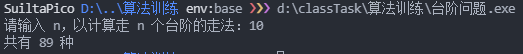
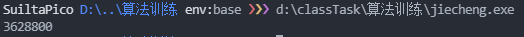

# 台阶问题
计算 n 个台阶的走法。为了防止溢出，采用了 `uint64_t` 类型。

## 代码
`台阶问题递推` 函数的复杂度：
* 时间复杂度： `O(n)`
* 空间复杂度： `O(1)`

```cpp
#include <cstdint>
#include <iostream>

using namespace std;
#include <iostream>
#include <cstdint>

using namespace std;

uint64_t 台阶问题递归(uint64_t n)
{
    if (n <= 2)
        return n;
    else
        return 台阶问题递归(n - 1) + 台阶问题递归(n - 2);
}

uint64_t 台阶问题递推(uint64_t n)
{
    uint64_t
        n1 = 0,
        n2 = 1;
    // 循环 n 次
    for (uint64_t x = 0; x < n; x++)
    {
        uint64_t cache = n1;
        n1 = n2;
        n2 += cache;
    }
    return n2;
}

int main()
{
    uint64_t n;
    cout << "请输入 n，以计算走 n 个台阶的走法：";
    cin >> n;
    cout << "共有 " << 台阶问题递推(n) << " 种" << endl;
    return 0;
}
```

## 运行结果截图


# 阶乘
计算 `n!`。

## 代码
```cpp
#include <cstdint>
#include <iostream>

using namespace std;

uint64_t 阶乘递归(uint64_t n)
{
    if (n == 1)
        return 1;
    else
        return n * 阶乘递归(n - 1);
}

uint64_t 阶乘递推(uint64_t n)
{
    uint64_t result = 1;
    for (uint64_t x = n; x > 0; x--)
        result *= x;
    return result;
}

int main()
{
    uint64_t n;
    cout << "请输入 n，以计算 n 的阶乘：";
    cin >> n;
    cout << "结果为：" << 阶乘递推(n) << endl;
    return 0;
}
```

## 运行结果截图

