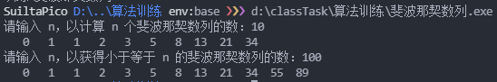
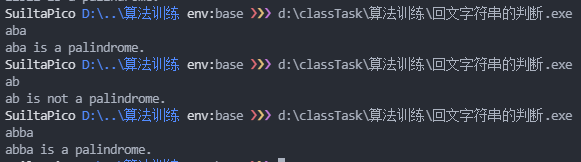
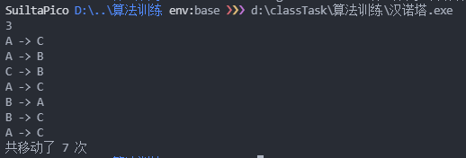
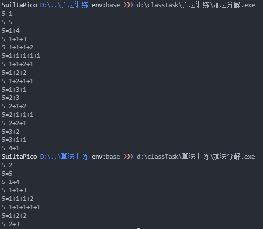

# 作业报告
## 斐波那契数列
[在线编译](https://gcc.godbolt.org/z/va4jz94Mc)
按照数量和大小求斐波那契数列。
### 代码
`斐波那契数列递推`函数的复杂度：
* 时间复杂度为 `O(n)`
* 空间复杂度为 `O(1)`

```cpp
#include <iostream>
#include <cstdint>
#include <cstdio>

using namespace std;

void 斐波那契数列递归(uint64_t n, uint64_t n1 = 0, uint64_t n2 = 1)
{
    if (n1 <= n)
    {
        printf("%4zu", n1);
        斐波那契数列递归(n, n2, n1 + n2);
    }
}

void 斐波那契数列递推(uint64_t n)
{
    uint64_t
        n1 = 0,
        n2 = 1;
    // 循环 n 次
    for (uint64_t x = 0; x < n; x++)
    {
        printf("%4zu", n1);
        uint64_t cache = n1;
        n1 = n2;
        n2 += cache;
    }
}

int main()
{
    uint64_t n;
    cout << "请输入 n，以计算 n 个斐波那契数列的数：";
    cin >> n;
    斐波那契数列递推(n);

    cout << endl;

    cout << "请输入 n，以获得小于等于 n 的斐波那契数列的数：";
    cin >> n;
    斐波那契数列递归(n);
    return 0;
}
```

### 运行结果截图


## 回文字符串的判断
[在线编译](https://gcc.godbolt.org/z/cET6hPYPc)
判断字符串是否是回文。
### 代码
`回文字符串判断递推`函数的复杂度：
* 时间复杂度为 `O(n)`
* 空间复杂度为 `O(1)`
```cpp
#include <cstring>
#include <iostream>

using namespace std;

bool 回文字符串判断递归(char *str)
{
    if (strlen(str) == 0 || strlen(str) == 1)
        return true;
    else if (str[0] != str[strlen(str) - 1]) // 判断前后是否相等
        return false;
    else
    {
        // 新字符串切片
        char *newstr = new char[strlen(str) - 1];
        for (size_t i = 0; i < strlen(str) - 2; i++)
            newstr[i] = str[i + 1];
        newstr[strlen(str) - 2] = '\0';

        bool result = 回文字符串判断递归(newstr);
        delete[] newstr; // 防止内存泄露
        return result;
    }
}

bool 回文字符串判断递推(char *str)
{
    size_t len = strlen(str);
    bool result = true;
    if (len == 0 || len == 1)
        return true;
    else
        for (size_t i = 0; i < len / 2; i++)
            if (str[i] != str[len - i - 1])
                result = false;
    
    return result;
}

int main()
{
    char str[1024];
    cin >> str;
    cout << str << " is ";
    if (!回文字符串判断递推(str))
        cout << "not ";
    cout << "a palindrome.";
}
```

### 运行结果截图


## 汉诺塔
[在线编译](https://gcc.godbolt.org/z/YqMjdG5fW)
求 `n` 个圆盘从柱子 `A` 移动到柱子 `C` 的步骤与次数。

每次移动都其实是在执行这几步：
1. 把当前“除最大的圆盘外的圆盘”先移到暂存位置。
2. 把当前最大的圆盘的移到目标位置。
4. 再把其他的“除最大的圆盘外的圆盘”从暂存位置移动到目标位置。

而在第 1、3 步，又可以再次拆分为同样的新问题：
> 求 `n-1` 个圆盘从一个柱子移动到另一个柱子的步骤与次数。

这里就可以使用递归的规则。

### 代码
```cpp
#include <iostream>

using namespace std;

/* 
 * @param n 圆盘的个数
 * @param original 原始位置的名字
 * @param temp 暂存位置的名字
 * @param target 目标位置的名字
 * @param counter 计数器指针
 */
void hanoi(int n, char original, char temp, char target, int &counter)
{
    // 没有任务则停止递归
    if (n <= 0)
        return;

    // 执行第 1 步，利用目标位置作为“除最大的圆盘外的圆盘”的暂存位置（“除最大的圆盘外的圆盘”都会比已经存在于目标位置的圆盘小）。
    // n-1 个为 “除最大的圆盘外的圆盘” 的个数。
    hanoi(n - 1, original, target, temp, counter);

    // 执行第 2 步，进行当前最大圆盘的移动
    counter += 1;
    cout << original << " -> " << target << endl;

    // 执行第 3 步，利用原始位置作为“除最大的圆盘外的圆盘”的暂存位置（“除最大的圆盘外的圆盘”也都会比已经存在于原始位置的圆盘小）。
    hanoi(n - 1, temp, original, target, counter);
}

int main()
{
    int n, counter = 0;
    cin >> n;
    hanoi(n, 'A', 'B', 'C', counter);
    cout << "共移动了 " << counter << " 次" << endl;
    return 0;
}
```

### 运行结果截图


## 加法分解
[在线编译](https://gcc.godbolt.org/z/1aGxrhd6d)
总结规律得，完成加法分解需要完成以下几步：
1. 按顺序输出栈内数字与自身
2. 遍历从 `1 + n-1` 到 `n-1 + 1` 的情况（如果 `m==2` 则遍历到`floor(n/2) + n-floor(n/2)` 的情况）。
3. 如果 `m==2` 过滤比左边数字小的，避免重复。
4. 把左边的数字入栈。
5. 递归，传递的当前值 `-=1`。
6. 出栈。

### 代码
```cpp
#include <iostream>
#include <vector>

using namespace std;

vector<int> stack;

void sear(int n, int m, int current = -1)
{
    if (current < 0) // 如果当前值为初始值 -1 ，则设其为 n
        current = n;
    else if (current == 0) // 结束递归的条件
        return;

    // 判定条件：当 m == 1 时，为 i < 当前值，否则为 i < 当前值/2 + 1 
    for (int i = 0; i < current / m + m - 1; i++) 
    {
        // 第一次循环将依次输出之前在栈内的数字与自身
        if (i == 0)
        {
            cout << n << "=";
            for (size_t j = 0; j < stack.size(); j++)
                cout << stack[j] << "+";
            cout << current << endl;
        }
        // 后面的循环则递归
        else
        {
            // 如果 m = 2，过滤掉后面比前面大的式子
            if (m == 2 && !stack.empty() && i < stack.back())
                return;
            
            // 把左边值加入栈
            stack.push_back(i);
            sear(n, m, current - i);
            stack.pop_back();
        }
    }
}

int main()
{
    int n, m;
    cin >> n >> m;
    sear(n, m);
}
```

### 运行结果截图

